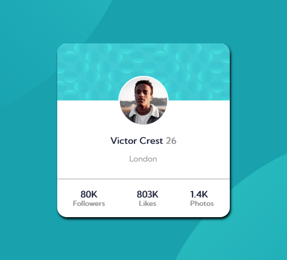

# Frontend Mentor - Profile card component solution

This is a solution to the [Profile card component challenge on Frontend Mentor](https://www.frontendmentor.io/challenges/profile-card-component-cfArpWshJ). Frontend Mentor challenges help you improve your coding skills by building realistic projects. 

## Table of contents

- [Overview](#overview)
  - [The challenge](#the-challenge)
  - [Screenshot](#screenshot)
  - [Links](#links)
- [My process](#my-process)
  - [Built with](#built-with)
  - [What I learned](#what-i-learned)
  - [Useful resources](#useful-resources)
- [Author](#author)
- [Acknowledgments](#acknowledgments)

## Overview

### The challenge

- Build out the project to the designs provided

### Screenshot





### Links

- Solution URL: [Add solution URL here](https://your-solution-url.com)
- Live Site URL: [Add live site URL here](https://your-live-site-url.com)

## My process

My first step was the card.
Second I did the positioning
Third I made the grid and then the flex model
### Built with

- Semantic HTML5 markup
- CSS custom properties
- Flexbox
- CSS Grid
- Mobile-first workflow


### What I learned

It has two structures of part code:
- This is the flex part

```html
<main class="flex">
    </main>
```
```css
.flex {
  background-color: $darkCyan;
  height: calc(100vh - 0px);
  background-image: url(../images/bg-pattern-top.svg),
    url(../images/bg-pattern-bottom.svg);
  background-repeat: no-repeat, no-repeat;
  background-position: right 50vw bottom 50vh, left 50vw top 50vh;
  display: flex;
}
```
- This is the grid part
```html
<main class="grid">
    </main>
```
```css
.grid {
  background-color: $darkCyan;
  height: calc(100vh - 0px);
  background-image: url(../images/bg-pattern-top.svg),
    url(../images/bg-pattern-bottom.svg);
  background-repeat: no-repeat, no-repeat;
  background-position: right 50vw bottom 50vh, left 50vw top 50vh;
  background-color: $darkCyan;
  display: grid;
  grid-template-areas:
    ". a a ."
    ". a a .";
}
```


### Useful resources

- [Flexbox](https://css-tricks.com/snippets/css/a-guide-to-flexbox/) - It's a guide to flexbox
- [Grid](https://css-tricks.com/snippets/css/complete-guide-grid/) - - It's a guide to Grid


## Author

- Website - [Matias Maldonado Lera](https://matiasmaldonadolera.github.io/MatiasMaldonadoLera/)
- Linkedin - [Matias Maldonado Lera](https://www.linkedin.com/in/matias-lera-maldonado-728b026b/)
- GitHub - [Matias Maldonado Lera](https://github.com/MatiasMaldonadoLera/)


## Acknowledgments

I was inspired by blueeweb videos